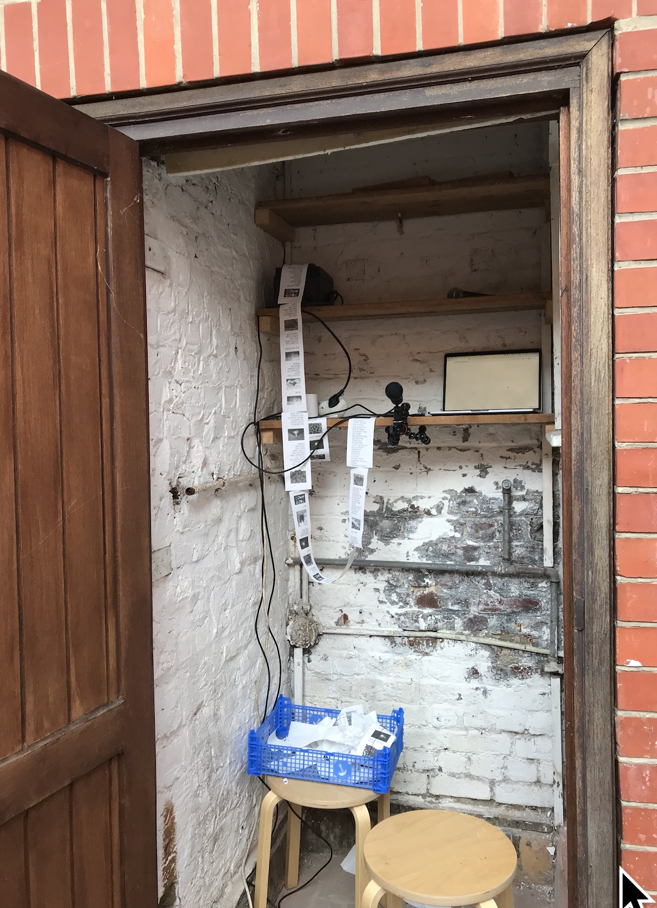

# momentary_imagefolder

variation on momentary zine as used in age of dust brussels in 2023



## about

This is a variation on the momentary zine tool made earlier. With a few differences: 

* it pulls a random image from the ```images``` folder in this repository instead of looking for it online. 
* it appends all the transcripts in one HTML file called ```zine_all.html```

**Wishlist**

The python script needs absolute path to root folder to pick images, but these are also saved in the zine-all.html file. As a result, you cannot open this file if it was created on a different computer. Now you manually have to edit the file to change the absolute path to a relative path so the images with show up. Can be changed in the server.sh/server.py folder but haven't dont it.

## python2 or python3

This branch works if you have Python2 installed and haven't upgraded to Python3 yet. To check, open terminal and type ```python``` if you have python 2 it will tell you which version, e.g. 2.7.16. 

Type in terminal ```python3``` if you don't have it it will tell you. 

If you have Python 3, don't use this branch but take the branch that is specific to python 3. 